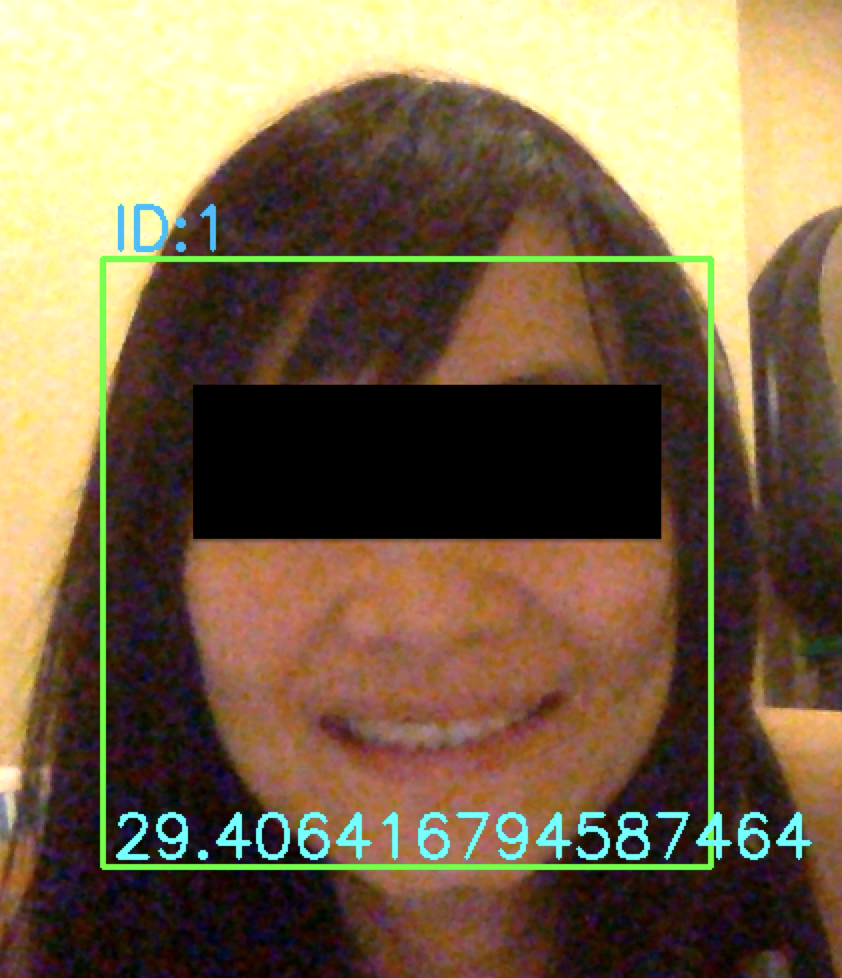

# computer_vision-face_identification
#### Sample source code for face detection and identification.

After running, the application will ask to press '1' for Face Detection or '2':Face Recognition.

**1. Face Detection**
- In case '1' is selected, it will ask you to enter the ID of user who the face on camera will be photographed. 
- Press 's' to save detected face to the storage and it will be used as a dataset.

**2. Face Identification**
- In case '2' is selected, the system will predict detected faces on the camera. It shows face bouding box and predicted ID and confidence value.

**Training model**

Inside the package 'model_building', there is a module 'modeling', run the file to train the model with your dataset and it will save a trained model to a specified file name ex. face_recognizer_model.yml
	
**Others**
- Press 'ESC' to exit program and close the camera.
- After running, the program will check if 'dataset' folder does exist or not, if not, the folder will be created to store photos of the user.
	- Structure of folder for dataset
		- dataset
			- userid
				- image files

**Sample result**

I just highlight my eyes a bit, I don't want to scare you! lol.
